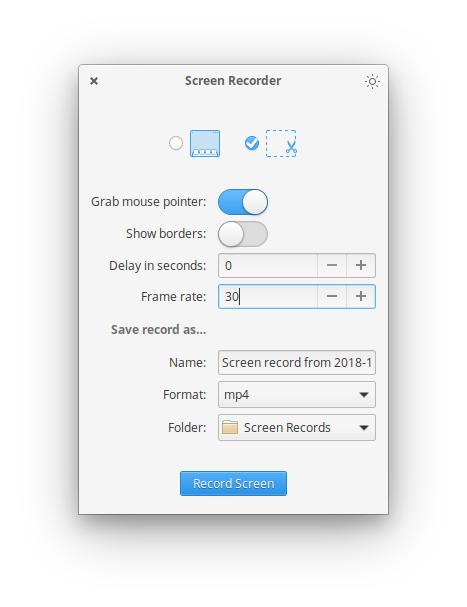

# A simple screen recorder app designed for elementary OS

A thin UI layer around FFmpeg for recording your screen.

Right now this is just a one night skecth, sooo don't look at the code :D

## Building & Installation

You'll need the following dependencies:

* meson
* libgranite-dev
* libgtk3-dev
* valac

Run `meson` to configure the build environment and then `ninja` to build and run automated tests

    meson build --prefix=/usr
    cd build
    ninja

To install, use `ninja install`, then execute with `com.github.mohelm97.screenrecorder`

    sudo ninja install
    com.github.mohelm97.screenrecorder

## Credits
A lot of this code inspired by the elementary OS screenshot app and Torikul Habib [mindi](https://github.com/torikulhabib/mindi).
